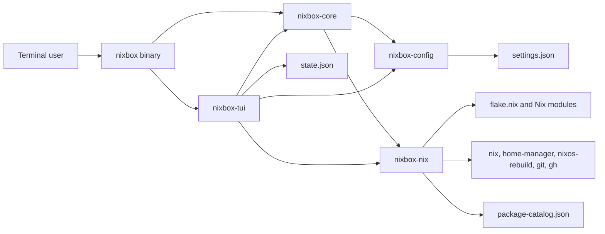
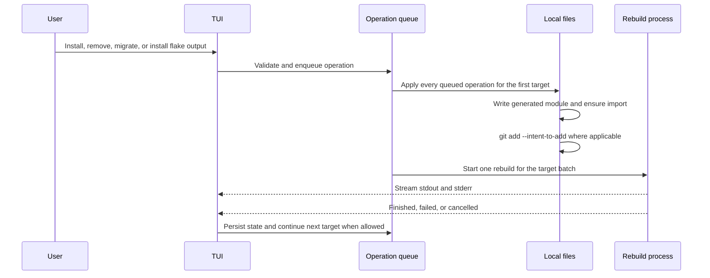

# Architecture

## System boundary

NixBox is a local terminal application. It does not run a daemon, expose an HTTP API, receive webhooks, or maintain a remote index. The process reads local configuration, calls the `nix`, `home-manager`, `nixos-rebuild`, `git`, and `gh` executables, writes local Nix and JSON files, and renders a Ratatui interface.

## Workspace crates

The workspace uses Rust edition 2024 and contains five crates. The dependency direction is intentionally simple.

| Crate | Responsibility | Local dependencies |
| --- | --- | --- |
| `nixbox-config` | Settings types, defaults, path resolution, JSON loading, and JSON saving. | None. |
| `nixbox-nix` | Package search, package catalog, generated manifests, source scanning and migration, flake discovery and installation, rebuild command selection, output streaming, and cancellation. | None. |
| `nixbox-core` | The headless engine: the `Op` type both front-ends queue, manifest mutation, import wiring, external-package scanning, flake input and output installation, and rebuild command selection. Reports progress through a `Reporter` rather than writing to a terminal. | `nixbox-config`, `nixbox-nix`. |
| `nixbox-tui` | Application state, terminal lifecycle, event handling, asynchronous task scheduling, operation queue, recovery state, Vim input behavior, navigation, themes, and rendering. | `nixbox-config`, `nixbox-core`, `nixbox-nix`. |
| `nixbox` | Clap command tree, the non-interactive commands, output rendering, tracing setup, Tokio runtime, and the call to `nixbox_tui::run` when no subcommand is given. | All four library crates. |

The crates.io publish order is `nixbox-config`, `nixbox-nix`, `nixbox-core`, `nixbox-tui`, then `nixbox`. The engine sits on the two leaf libraries, and both front-ends sit on the engine.

Both front-ends go through the same engine, so a change applied by `nixbox install` and the same change applied in the TUI take the identical code path. The engine is also what keeps `state.json` compatible between them: the queue holds `nixbox_core::Op` values verbatim, and the TUI's `QueuedOp` is a re-export of that type rather than a parallel definition.

## Startup and terminal lifecycle

`crates/nixbox/src/main.rs` parses the command tree, initializes tracing to stderr with a default `warn` filter, and dispatches on Tokio's multithreaded runtime. With no subcommand it calls `nixbox_tui::run()`; with one it runs that command and returns its exit code. It also restores the default `SIGPIPE` disposition, so piping output into `head` ends the process quietly instead of panicking on a broken pipe.

`run()` loads settings and manifests before changing terminal state. It then enables raw mode, enters the alternate screen, selects a blinking bar cursor, and starts the event loop. On normal return it disables raw mode, restores the cursor shape, leaves the alternate screen, and shows the cursor. Errors returned after terminal initialization still pass through this cleanup path because `run()` stores the event-loop result before restoring the terminal.

## Application state

`App` in `crates/nixbox-tui/src/app.rs` owns the complete live state. Important groups are:

- Configuration and manifests: `config`, `home_manifest`, `nixos_manifest`, and `external_packages`.
- Package search: the input editor, results, selected row, epoch, latest query, catalog handle, loading state, and task handles.
- Flake search: a separate input editor, results, selected row, details, epochs, query, loading flags, and task handles.
- Installed view: filter input and selected combined row.
- UI state: active tab, settings page, status, theme index, spinner frame, and quit flag.
- Build state: output log, active flag, cancellation sender, current label, pending queue, in-progress recovery descriptor, and last error.

The application stores package catalogs in `Arc<PackageCatalog>` because searches move a cloned reference into `spawn_blocking` without copying more than 100,000 package documents.

## Event loop

The event loop redraws the full UI, then waits in `tokio::select!` for one of three inputs:

1. A Crossterm terminal event.
2. An `AppEvent` sent through a bounded channel with capacity 128.
3. An 80 ms spinner tick while any search, catalog, detail, or build task is active.

Terminal events mutate the `App` directly or schedule asynchronous work. Background work reports completion through `AppEvent`. Package search, flake search, and flake detail results include monotonically increasing epochs. The event handler ignores a result when its epoch no longer matches current state, so a slow old request cannot overwrite a newer query.

When the user quits, the event loop aborts package-search, flake-search, flake-detail, and catalog tasks. Rebuild work uses its own process cancellation path and persisted recovery state.

## Package operation flow

The queue contains `Install`, `InstallFlake`, `InstallFlakePackage`, `Uninstall`, and `Migrate` variants. `drain_queue` takes the target from the first queued operation, removes every queued operation for that target, applies them in their existing order, and launches one rebuild. Operations for the other target remain queued.

File mutation happens before the rebuild. A failed rebuild does not restore previous files. This matches the recovery model: an interrupted rebuild can run again because the generated files already represent the requested state.

## Module map

### `nixbox-config`

- `lib.rs` defines `Config`, `Target`, `InputMode`, default values, recent-search maintenance, settings persistence, and all target path calculations.

### `nixbox-nix`

- `search.rs` owns live search, the locked-revision catalog, cache serialization, bounded subprocess output, package-attribute normalization, and relevance ranking.
- `manifest.rs` owns generated package and flake-module files, package marker parsing, rendering, relative import paths, and insertion into a main module's `imports` list.
- `scan.rs` detects simple package tokens in selected Nix lists and removes dedicated lines during migration.
- `flakes.rs` calls GitHub through `gh api`, ranks repository candidates, evaluates locked revisions for package and module outputs, caches inspections in memory, reads root `flake.nix` files for input names, and edits a conventional root flake for output installation.
- `build.rs` resolves executables in common Nix profiles, chooses Home Manager or NixOS commands, starts rebuild process groups, forwards output, and cancels a complete process group.
- `lib.rs` exports these modules and their main types and functions.

### `nixbox-core`

- `op.rs` defines `Op`, the unit of work both front-ends queue. Its variant and field names are an on-disk format, because the queue is persisted verbatim in `state.json`.
- `engine.rs` owns `Engine`, which holds the settings and both manifests, applies an `Op`, writes the managed file, wires the import into the main config, stages files for Git-aware flake evaluation, and installs or removes flake inputs and outputs.
- `rebuild.rs` selects the rebuild command for a target and reports when a Home Manager rebuild falls back to `nixos-rebuild`.
- `report.rs` defines the `Reporter` trait plus a silent and a log-collecting implementation, which is how the same engine feeds the TUI's log pane and the CLI's stderr.

### `nixbox`

- `cli.rs` defines the Clap command tree, the global `--target`, `--channel`, and `--json` flags, and dispatch.
- `apply.rs` is the shared path for every command that changes configuration: confirmation, the dry run, writing, the rebuild, and the exit code.
- `commands/` holds one module per subcommand.
- `render.rs` renders tables and field lists for the non-JSON output.

### `nixbox-tui`

- `app.rs` owns `App`, startup scanning, terminal setup, the event loop, visible-tab rules, combined installed-package state, and task cleanup.
- `handlers.rs` translates key presses and `AppEvent` values into state changes.
- `ops.rs` schedules searches, prepares the package catalog, validates operations, batches the queue, and starts rebuilds. The manifest mutation itself is delegated to `nixbox-core`.
- `state.rs` serializes and restores pending operations, interrupted rebuilds, and the previous error.
- `vim.rs` implements Unicode-aware cursor movement, Vim word and WORD motions, selection, deletion, and the two-key `dd` command.
- `nav.rs` handles wrapped row selection, tab movement, and settings entry.
- `theme.rs` defines six palettes and their Ratatui styles.
- `ui/` renders the shared bars, package search, flake search and detail panel, installed list, build log, queue, and settings popup.

## Design constraints

- NixBox uses source-text heuristics instead of a full Nix parser for scanning user files, inserting imports, reading flake input names, and updating the root flake. Package and module eligibility comes from pure Nix evaluation of a locked GitHub revision. The mutation code rejects expressions it cannot handle safely, but conventional file structure is still required.
- Search consistency comes from the target's direct locked nixpkgs revision, not from a server-side index or notification system.
- State persistence is best effort. Settings and manifest failures return errors; queue-state save failures do not stop the TUI.
- Generated nixpkgs package sets use `BTreeSet`, and generated external-flake module and package mappings use `BTreeMap`, so output order is deterministic.
- The build log is bounded to 1,000 lines, live-search stdout to 50 MiB, catalog stdout to 256 MiB, search stderr retention to 64 KiB, package results to 200, and flake results to 20.
