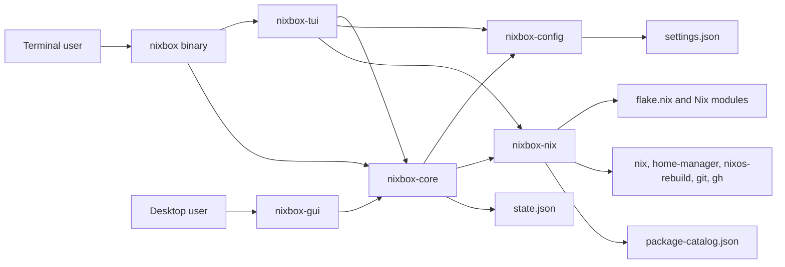
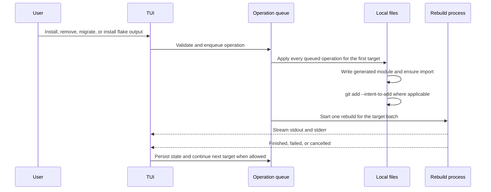

# Architecture

## System boundary

NixBox is a local application with three front-ends: a terminal UI, a command line, and a desktop GUI. It does not run a daemon, expose an HTTP API, receive webhooks, or maintain a remote index. The process reads local configuration, calls the `nix`, `home-manager`, `nixos-rebuild`, `git`, and `gh` executables, writes local Nix and JSON files, and renders a Ratatui or gpui interface.

```mermaid
flowchart LR
		User[Terminal user] --> Binary[nixbox binary]
		Binary --> TUI[nixbox-tui]
		Binary --> Core[nixbox-core]
		TUI --> Core
		GUIUser[Desktop user] --> GUI[nixbox-gui]
		GUI --> Core
		Core --> Config[nixbox-config]
		Core --> Nix[nixbox-nix]
		TUI --> Config
		TUI --> Nix
		Config --> Settings[settings.json]
		Nix --> Target[flake.nix and Nix modules]
		Nix --> Commands[nix, home-manager, nixos-rebuild, git, gh]
		Core --> State[state.json]
		Nix --> Cache[package-catalog.json]
```

## Workspace crates

The workspace uses Rust edition 2024 and contains eight crates. The dependency direction is intentionally simple.

| Crate | Responsibility | Local dependencies |
| --- | --- | --- |
| `nixbox-config` | Settings types, defaults, path resolution, JSON loading, JSON saving, and the list of theme names. | None. |
| `nixbox-nix` | Package search, package catalog, generated manifests, source scanning and migration, flake discovery and installation, rebuild command selection, output streaming, and cancellation. | None. |
| `nixbox-core` | The headless engine: the `Op` every front-end queues, the persisted `state.json` format, manifest mutation, import wiring, external-package scanning, flake input and output installation, rebuild command selection and privilege escalation, and the `Session` that drives queued ops through rebuilds for the interactive front-ends. Reports progress through a `Reporter` rather than writing to a terminal. | `nixbox-config`, `nixbox-nix`. |
| `nixbox-tui` | Terminal lifecycle, event handling, search scheduling, Vim input behavior, navigation, themes, and rendering. The queue and rebuilds are the `Session`'s. | `nixbox-config`, `nixbox-core`, `nixbox-nix`. |
| `nixbox-gui` | The `nixbox-gui` binary: a gpui desktop front-end over the same `Session`, and sudo's askpass helper for its system rebuilds. Not published to crates.io yet. | `nixbox-config`, `nixbox-core`, `nixbox-nix`. |
| `nixbox-cmd` | Clap command tree, the non-interactive commands, output rendering, tracing setup, and the call to `nixbox_tui::run` when no subcommand is given. Shared by both binaries. | `nixbox-config`, `nixbox-core`, `nixbox-nix`, and `nixbox-tui` behind the `tui` feature. |
| `nixbox` | The `nixbox` binary: a `main` that calls `nixbox_cmd::run`, with the `tui` feature on. | `nixbox-cmd`. |
| `nixbox-cli` | The `nixbox-cli` binary: the same `main`, with the `tui` feature off. | `nixbox-cmd`. |

The crates.io publish order is `nixbox-config`, `nixbox-nix`, `nixbox-core`, `nixbox-tui`, `nixbox-cmd`, `nixbox`, then `nixbox-cli`. The engine sits on the two leaf libraries, both front-ends sit on the engine, and the two binaries sit on the command tree.

`nixbox-gui` is outside that order because it is not published. It is also left out of `default-members`, `just ci`, and the workspace-wide CI steps, because building it needs the graphics stack (Wayland, xkbcommon, X11, Vulkan, fontconfig); `just gui-ci` and a separate CI job cover it.

There are two published binaries rather than one binary with a switch, because crates.io lists packages and not feature combinations. `nixbox` and `nixbox-cli` are both a four-line `main` over `nixbox-cmd`; the only difference is whether they enable that crate's `tui` feature. `nixbox-cli` pulls 60 packages against `nixbox`'s 108, excluding `ratatui`, `crossterm`, `tui-input`, and `nixbox-tui` itself.

Nothing the command line needs lives in the UI crate: the theme names the settings file accepts are declared in `nixbox-config` and the persisted-state format in `nixbox-core`, each with a test in the UI crate asserting the two stay in step.

The two binaries install under different names, so one profile can hold both. `nixbox-cmd` learns which one is running from `env!("CARGO_BIN_NAME")`, passed into `run`, and uses it for the usage line, the generated completion script, and every message that tells the user what to run next.

Every front-end goes through the same engine, so a change applied by `nixbox install`, in the TUI, or in the GUI takes the identical code path. The TUI and the GUI also share the `Session`, so queue batching, rebuild cancellation, the build log, and recovery behave the same in both. The engine is also what keeps `state.json` compatible between them: the queue holds `nixbox_core::Op` values verbatim, and the TUI's `QueuedOp` is a re-export of that type rather than a parallel definition.

## Startup and terminal lifecycle

`crates/nixbox-cmd/src/lib.rs` parses the command tree, initializes tracing to stderr with a default `warn` filter, and dispatches on Tokio's multithreaded runtime, driven by a `main` in whichever binary crate was built. With no subcommand it calls `nixbox_tui::run()`; with one it runs that command and returns its exit code. It also restores the default `SIGPIPE` disposition, so piping output into `head` ends the process quietly instead of panicking on a broken pipe.

`run()` loads settings and manifests before changing terminal state. It then enables raw mode, enters the alternate screen, selects a blinking bar cursor, and starts the event loop. On normal return it disables raw mode, restores the cursor shape, leaves the alternate screen, and shows the cursor. Errors returned after terminal initialization still pass through this cleanup path because `run()` stores the event-loop result before restoring the terminal.

## Application state

`App` in `crates/nixbox-tui/src/app.rs` owns the complete live state. Important groups are:

- Package search: the input editor, results, selected row, epoch, latest query, catalog handle, loading state, and task handles.
- Flake search: a separate input editor, results, selected row, details, epochs, query, loading flags, and task handles.
- Installed view: filter input and selected combined row.
- UI state: active tab, settings page, status, theme index, spinner frame, and quit flag.
- `session`: a `nixbox_core::Session` holding the engine, the pending queue, the build log, the running rebuild and its cancel sender, and the last error.

The application stores package catalogs in `Arc<PackageCatalog>` because searches move a cloned reference into `spawn_blocking` without copying more than 100,000 package documents.

## Event loop

The event loop redraws the full UI, then waits in `tokio::select!` for one of three inputs:

1. A Crossterm terminal event.
2. An `AppEvent` sent through a bounded channel with capacity 128.
3. A `BuildEvent` from the receiver `Session::new` returned, handed to `Session::on_build_event`.
4. An 80 ms spinner tick while any search, catalog, detail, or build task is active.

Terminal events mutate the `App` directly or schedule asynchronous work. Background work reports completion through `AppEvent`. Package search, flake search, and flake detail results include monotonically increasing epochs. The event handler ignores a result when its epoch no longer matches current state, so a slow old request cannot overwrite a newer query.

When the user quits, the event loop aborts package-search, flake-search, flake-detail, and catalog tasks. Rebuild work uses its own process cancellation path and persisted recovery state.

## Package operation flow

```mermaid
sequenceDiagram
		participant U as User
		participant T as TUI
		participant Q as Operation queue
		participant F as Local files
		participant R as Rebuild process
		U->>T: Install, remove, migrate, or install flake output
		T->>Q: Validate and enqueue operation
		Q->>F: Apply every queued operation for the first target
		F->>F: Write generated module and ensure import
		F->>F: git add --intent-to-add where applicable
		Q->>R: Start one rebuild for the target batch
		R-->>T: Stream stdout and stderr
		R-->>T: Finished, failed, or cancelled
		T->>Q: Persist state and continue next target when allowed
```

The queue contains `Install`, `InstallFlake`, `InstallFlakePackage`, `UninstallFlake`, `UninstallFlakeOutput`, `Uninstall`, and `Migrate` variants. `Session::enqueue` skips an op when the same work is already waiting (`Op::duplicates`). `Session::drain` takes the target from the first queued operation, removes every queued operation for that target, applies them in their existing order, and launches one rebuild. Operations for the other target remain queued.

File mutation happens before the rebuild. A failed rebuild does not restore previous files. This matches the recovery model: an interrupted rebuild can run again because the generated files already represent the requested state.

## Module map

### `nixbox-config`

- `lib.rs` defines `Config`, `Target`, `InputMode`, default values, recent-search maintenance, settings persistence, and all target path calculations.

### `nixbox-nix`

- `search.rs` owns live search, the locked-revision catalog, cache serialization, bounded subprocess output, package-attribute normalization, and relevance ranking.
- `manifest.rs` owns generated package and flake-module files, package marker parsing, rendering, relative import paths, and insertion into a main module's `imports` list.
- `scan.rs` detects simple package tokens in selected Nix lists and removes dedicated lines during migration.
- `flakes.rs` calls GitHub through `gh api`, ranks repository candidates, evaluates locked revisions for package and module outputs, caches inspections in memory, reads root `flake.nix` files for input names, and edits a conventional root flake for output installation.
- `build.rs` resolves executables in common Nix profiles, chooses Home Manager or NixOS commands, starts rebuild process groups, forwards output, and cancels a complete process group.
- `lib.rs` exports these modules and their main types and functions.

### `nixbox-core`

- `op.rs` defines `Op`, the unit of work both front-ends queue. Its variant and field names are an on-disk format, because the queue is persisted verbatim in `state.json`.
- `state.rs` defines `PersistedState` and `InProgress`, the `state.json` format, and its load, save, and clear operations. It lives here rather than in the UI crate because `nixbox resume` reads the same file.
- `engine.rs` owns `Engine`, which holds the settings and both manifests, applies an `Op`, writes the managed file, wires the import into the main config, stages files for Git-aware flake evaluation, and installs or removes flake inputs and outputs.
- `rebuild.rs` selects the rebuild command for a target, reports when a Home Manager rebuild falls back to `nixos-rebuild`, applies the `Escalation` (plain `sudo`, or `sudo -A` with an askpass helper), and `run` resolves and runs the rebuild, racing the cancel signal. The CLI and the `Session` both use `run`.
- `session.rs` owns `Session`, the operation pipeline behind the TUI and the GUI: deduplicated enqueueing, per-target batching, one rebuild at a time, cancellation, the capped build log, `state.json` persistence, and restoring an interrupted run. Rebuilds are spawned on a tokio runtime handle, so a front-end whose own loop is not tokio can still drive it.
- `search.rs` searches the package catalog when it is ready and falls back to live `nix search`, and names the catalog cache path.
- `report.rs` defines the `Reporter` trait plus a silent and a log-collecting implementation, which is how the same engine feeds the TUI's log pane and the CLI's stderr.

### `nixbox-cmd`

- `lib.rs` restores the default `SIGPIPE` disposition, records the running binary's name, parses arguments, starts tracing, and dispatches.
- `cli.rs` defines the Clap command tree, the global `--target`, `--channel`, and `--json` flags, and dispatch. The `tui` subcommand and the no-subcommand default are behind the `tui` feature; without it, a bare `nixbox` prints help and exits `1`.
- `apply.rs` is the shared path for every command that changes configuration: confirmation, the dry run, writing, the rebuild, and the exit code.
- `commands/` holds one module per subcommand.
- `commands/mod.rs` also holds `search_packages`, the shared lookup behind `search` and `install`: it prefers the cached package catalog and falls back to live search, and an explicit `--channel` always searches live.
- `commands/resume.rs` finishes an interrupted rebuild and drains a queue the TUI left, one target at a time.
- `render.rs` renders tables and field lists for the non-JSON output.

### `nixbox` and `nixbox-cli`

- `main.rs` in each is the same four lines: a Tokio entry point handing `env!("CARGO_BIN_NAME")` to `nixbox_cmd::run`. All behavioural difference comes from the `tui` feature their `Cargo.toml` selects.

### `nixbox-tui`

- `app.rs` owns `App`, startup scanning, terminal setup, the event loop, visible-tab rules, combined installed-package state, and task cleanup.
- `handlers.rs` translates key presses and `AppEvent` values into state changes.
- `ops.rs` schedules searches, prepares the package catalog, turns the selected row into an `Op`, and reports what the `Session` did with it.
- `state.rs` turns what `Session::restore` picked up into the starting tab and status line.
- `vim.rs` implements Unicode-aware cursor movement, Vim word and WORD motions, selection, deletion, and the two-key `dd` command.
- `nav.rs` handles wrapped row selection, tab movement, and settings entry.
- `theme.rs` defines the Ratatui styles for the six palettes named in `nixbox-config::THEMES`, with a test asserting the two lists match.
- `ui/` renders the shared bars, package search, flake search and detail panel, installed list, build log, queue, and settings popup.

### `nixbox-gui`

- `main.rs` starts a multithreaded tokio runtime for the nix work, builds a `Session` with `Escalation::Askpass` pointing at its own executable, and opens the window. Started by sudo as the askpass helper (`NIXBOX_ASKPASS` set), it shows the password prompt instead.
- `askpass.rs` is that prompt: it prints the password to stdout for sudo, or exits non-zero on cancel so the rebuild stops.
- `app.rs` owns `NixboxApp`, the window state. Searches and flake lookups run on the tokio runtime; gpui tasks await their join handles, debounce input, and discard stale results by epoch, as the TUI does. A gpui task feeds `BuildEvent`s to the `Session` and raises notifications when a rebuild ends.
- `model.rs` computes the Installed page's filtered sections and a search hit's installed scopes without gpui, so they are unit tested.
- `theme.rs` maps the theme names in `nixbox-config::THEMES` onto gpui-component: `default` follows the desktop appearance, the others are dark with the TUI palette's background and accent.
- `ui/` renders the sidebar, status line, and the nixpkgs, Flakes, Installed, Queue, Build, and Settings pages with gpui-component, as flat lists separated by rules.

## Design constraints

- NixBox uses source-text heuristics instead of a full Nix parser for scanning user files, inserting imports, reading flake input names, and updating the root flake. Package and module eligibility comes from pure Nix evaluation of a locked GitHub revision. The mutation code rejects expressions it cannot handle safely, but conventional file structure is still required.
- Search consistency comes from the target's direct locked nixpkgs revision, not from a server-side index or notification system.
- State persistence is best effort. Settings and manifest failures return errors; queue-state save failures do not stop the TUI or the GUI.
- Nothing stops two front-ends running at once. Both would write `state.json` and the managed files, so running the TUI and the GUI side by side is not supported.
- Generated nixpkgs package sets use `BTreeSet`, and generated external-flake module and package mappings use `BTreeMap`, so output order is deterministic.
- The build log is bounded to 1,000 lines, live-search stdout to 50 MiB, catalog stdout to 256 MiB, search stderr retention to 64 KiB, package results to 200, and flake results to 20.
